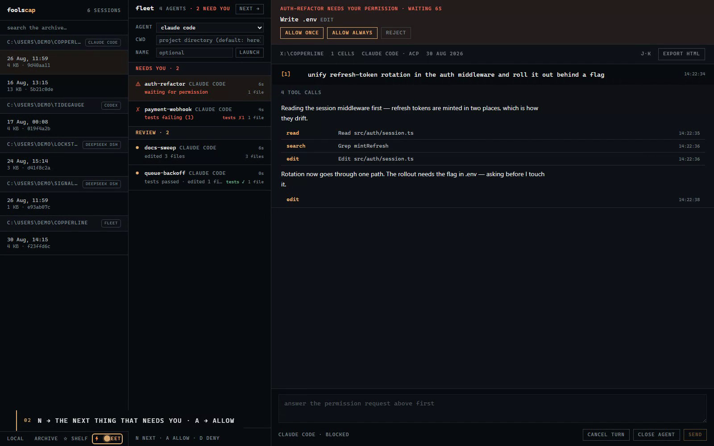

# foolscap

**Your agent history, turned into something you can use — and one queue
for every agent you're running.**




foolscap does five things, all on your machine:

- **The coordinator — tell it what needs doing.** GPT-6 Astra plans the
  work and routes it to your coding agents, which run here. Dispatch is
  asynchronous, so it keeps planning while they work, and every result
  comes back as *foolscap's* evidence — test runs, edited files, the
  agent's last words — never the agent's claim. Foolscap enforces bounded
  repair and independent-review stages on the server, so the planning
  model cannot skip them or declare unfinished work complete.
- **The workspace — context to execution.** Connect repositories and notes,
  explore their file/import/link graph, capture work on a Kanban board, and
  dispatch ready tasks to your agents under budget and concurrency
  limits. Budgets count the cost agents *report*: Claude Code reports it
  natively; ACP agents, Devin and Warp don't, and their spend shows as
  "not reported" rather than as zero. Every routing decision and
  execution attempt stays reviewable.
- **The fleet — many agents, one queue.** Run Claude Code, Codex,
  OpenCode, Antigravity or Warp side by side, and Devin in the cloud. foolscap drives them, so it knows which one is
  blocked on you, whose tests just went red, and which to leave alone.
  `n` jumps to the next thing that needs you.
- **The prompt shelf — your prompt library, derived.** Every prompt
  you've ever sent, deduplicated, with reuse counts and **outcome
  evidence**: which ones actually worked, read from what happened next.
  No model call.
- **Sessions as documents.** Every run, from any harness, rendered as a
  notebook you can read top to bottom, search, export as one HTML file,
  and hand to someone else.

> _foolscap: the paper ledgers were written on._

---

## Why

Terminals are superb for issuing precise commands and terrible for reading
what an agent *did* — and hopeless for keeping track of five agents at
once. The record of hours of agent work disappears into scrollback, or
into JSONL files nobody opens. foolscap treats that record as the asset
it is:

- **Reviewable** — see every change an agent made, as diffs, in context
- **Recallable** — "what did we do in Tuesday's session?" has an answer
- **Reusable** — the prompts that worked are one click from working again
- **Steerable** — the agents running now are one queue, not five tabs
- **Yours** — local-first; your sessions never leave your disk

Workspace state lives at `~/.foolscap/workspace.json`. Connecting a source
indexes up to 400 text/code files while skipping generated, dependency, and
hidden directories. Everything lives under **▸ Work** in the sidebar, as
five tabs: **overview**, **board** (add and move tasks), **graph**
(files and links in what you connected), **usage** (cost evidence and
routing reasons) and **voice**. **Dispatch ready** fills available fleet capacity using the
workspace's budget and load policy. "auto" routes to Claude Code first,
then Codex and OpenCode by load; Devin, Warp and Antigravity run only
when you name them. A checkout has one active writer at a time, while
independent repositories can still use the configured global capacity.

**Voice** is the local BYOK path: set `OPENAI_API_KEY`, open the voice tab
under Work, and start a conversation. The browser connects to `gpt-live-1` over WebRTC
through Foolscap's loopback session broker, so the project key never enters
browser JavaScript. GPT-Live delegates workspace operations to a low-latency
Responses backend (`gpt-5.6-luna` by default), which calls the same local
task, search, and coordinator APIs as the visual interface. Override the
backend with `FOOLSCAP_VOICE_BACKEND_MODEL`; use the comma-separated
`FOOLSCAP_VOICE_BACKEND_MODELS` allowlist to expose choices in the UI.
Two of its tools reach the
coordinator: say what needs doing and, once you've said *go*, it starts a
run; ask *what needs me?* and it reads back the agent queue and any open
coordinator question, most urgent first.

```sh
OPENAI_API_KEY=your_project_key npx foolscap
npx foolscap doctor
```

`foolscap doctor` reads the actual environment and installed commands. It
reports provider readiness, the exact live/backend models, and whether at
least two different local-agent families are ready for independent review.
It exits nonzero while a launch prerequisite is missing; `--json` emits the
same report for packaging or support scripts. A final voice check still
requires starting a browser session and granting microphone permission.

## Install

Linux, no root, no npm — one line:

```sh
curl -fsSL https://raw.githubusercontent.com/N-45div/foolscap/main/install.sh | sh
```

It uses your Node if it's 22 or newer, otherwise keeps a private copy
under `~/.foolscap/node`; the release bundle is checksummed and unpacked
to `~/.foolscap/app`; `foolscap` lands in `~/.local/bin`. `foolscap
update` re-runs it. Read the script first if you like — it's short.

Everywhere else, and on Linux if you'd rather:

```sh
npx foolscap
```

## Supported harnesses

foolscap is **harness-agnostic by design**: every harness is one adapter
that maps its on-disk log format into a neutral session document. The
renderer, exporter and skill never know which tool wrote the session.

| Harness | Status | Reads from |
|---|---|---|
| Claude Code | ✅ | `~/.claude/projects/**/*.jsonl` |
| Codex CLI | ✅ | `~/.codex/sessions/**/rollout-*.jsonl` |
| DeepSeek Harness (dsh) | ✅ | `~/.dsh/…/session.jsonl[.zstd]` |
| **Claude Code, natively**, via the fleet | ✅ | `~/.foolscap/acp/*.jsonl` (recorded by foolscap) |
| **Any ACP agent**, via the fleet | ✅ | `~/.foolscap/acp/*.jsonl` (recorded by foolscap) |
| **Devin** (cloud), via the fleet | ✅ | `~/.foolscap/acp/*.jsonl` (recorded by foolscap) |
| OpenCode | ✅ | `~/.local/share/opencode/opencode.db` (SQLite, read-only; Node 22.5+) |
| Antigravity CLI / IDE | fleet ✅ (community adapter, see note) · archive: help wanted | — |
| Warp Agent | fleet ✅ (`oz agent run`, one process per turn — built from Warp's docs; please report) · archive: none (conversations sync to your Warp account) | — |
| Conductor | next week | — |

dsh sessions are zstd-compressed by default; foolscap decompresses them
with Node's built-in zstd (Node 22.15+ — plain `.jsonl` works on any
supported Node). `DSH_HOME` is honored, same as dsh itself. OpenCode keeps
its sessions in SQLite; foolscap reads the database read-only through
Node's built-in `node:sqlite` (22.5+) and honors `OPENCODE_DATA_DIR`.

Your harness missing? [Adding one is a single file](#add-a-harness).

## Quickstart

One command, no clone (Node 20+):

```sh
npx foolscap
```

It serves on **127.0.0.1 only** — your sessions are private data and never
leave your machine — and opens the viewer on your archive. **Zero
configuration**: if you've used Claude Code, Codex or DeepSeek Harness,
it's already there.
`foolscap --root <dir>` views a copied or curated archive; `--port` and
`--no-open` do what they say.

For development (Node 24+ and pnpm):

```sh
git clone https://github.com/N-45div/foolscap
cd foolscap
pnpm install
pnpm dev        # http://localhost:5173
```

## The fleet — many agents, one queue

Running five agents at once fails for one reason: every surface shows
you five terminals, so you poll all of them and the bookkeeping costs
more than the work. The fleet inverts it. foolscap **drives** each agent
— it sends the prompts, receives the stream, answers permission
requests — so it knows, exactly and live, which agent is **blocked on
you**, which one's **tests just went red**, which is **done and
waiting**, and which is fine and should be left alone. That's shown as
a queue, not a grid:

```
needs you   ⚠ auth-refactor     waiting for permission        12s
            ✗ payment-webhook   tests failing (2)             4m
review      ● docs-sweep        tests passed · edited 3 files  1m
working     ◌ queue-backoff     pnpm test                     —
```

- **`n`** jumps to whatever needs you next; **`a`** / **`d`** answer a
  permission request. Inbox zero, for agents.
- The tab title carries the count — `(2) foolscap — needs you` — so you
  can be in another window.
- Each agent opens as a document: the same renderer as the archive,
  because it is the same document. Every session is recorded, so it's
  in your archive the moment it ends, with the same outcome evidence.
- Local and cloud in one queue: a Devin session sits next to your Claude
  Code and Codex runs, and when Devin asks a question it needs you the
  same way a permission prompt does.

Open **⚡ Agents** in the sidebar. Launching an agent runs code on your
machine, so the fleet API is loopback-only and refuses cross-origin
requests outright.

### Drivers

| Agent | How foolscap drives it | Permissions |
|---|---|---|
| **Claude Code** (default) | natively: `claude -p` with `stream-json` in and out — no adapter, nothing to download | Claude Code's `--permission-prompt-tool`, relayed through a tiny MCP server foolscap registers per session |
| Codex, OpenCode, Claude Code via its adapter | [ACP](https://agentclientprotocol.com) over stdio | ACP `session/request_permission` |
| **Antigravity CLI** (`agy`) | ACP via the community adapter `agy-acp` — **read its README first**: Google's FAQ treats third-party access as a terms-of-service violation, so use an API-key setup or a secondary account. Antigravity has no headless mode of its own yet. | ACP |
| Anything else that speaks ACP | give the launch command as the agent name | ACP |
| **Devin** (cloud) | Devin's session API, polled — set `DEVIN_API_KEY` | Devin's questions land in the queue; you answer in text |
| **Warp Agent**, and any CLI with a headless `--prompt` | the **command driver**: one process per turn, prompt and folder filled into a template (`oz agent run --prompt … --cwd … --output-format json`), output read back | none — headless runs auto-approve by the agent's own config, so "needs you" means the turn ended |

Overrides, for custom installs or wrappers: `FOOLSCAP_CLAUDE="…"` for the
native driver's binary; `FOOLSCAP_ACP_CLAUDE`, `_CODEX`, `_OPENCODE`,
`_ANTIGRAVITY` for the ACP adapters' launch commands; `FOOLSCAP_WARP` for
the whole command line of a command-driver agent, with `{prompt}` and
`{cwd}` placeholders — e.g. to switch to the `warp` binary once its
headless flags are published. Adding a driver is one file under
`server/drivers/` implementing `start / prompt / answerPermission /
cancel / close` and feeding frames to the session.

### `foolscap acp` — an agent over the network

ACP standardizes the client↔harness boundary, but every client today
spawns its agent as a local subprocess. `foolscap acp` serves any stdio
ACP agent over an authenticated WebSocket, so you can hand the endpoint
to a client anywhere — and the session is recorded here.

```sh
foolscap acp --agent claude --cwd ~/myproject
# → ws://127.0.0.1:4518/?token=<generated>
```

A token is required and generated per run (there is no open mode);
loopback is the default and `--expose` warns loudly.

## The coordinator — one conversation that runs your agents

Open **▸ Work**, type what needs doing, press run. The coordinator is
GPT-6 Astra over the Responses API, with seven tools, and it works like a
careful lead: it searches the connected folders before it writes a brief,
puts a task on the board, and dispatches it to an agent on your machine.

Two of Astra's primitives are the whole design:

- **Async tool calling.** `dispatch_task` is marked `async`, so Astra
  issues it and keeps going — planning, dispatching an independent task,
  or answering you. The result arrives later, by call id, and that result
  is what foolscap observed: test commands and their output, files edited,
  errors, the agent's final message, cost. The model reads evidence; it
  is never asked whether the agent succeeded.
- **The loop runs on evidence.** Red tests or errors dispatch a repair on
  the same task with the failing output attached, at most twice. Green
  tests with edited files dispatch a read-only review to a *different*
  agent; review repairs are bounded to one and the reviewer must return a
  machine-readable PASS or CHANGES_REQUESTED verdict. These transitions
  are enforced by Foolscap's server state. Astra cannot end the run while
  required repair or review work remains. It asks you one question, and
  only when the answer changes the work; the run shows **needs you** until
  you answer.

Every run is durable — each event lands in `~/.foolscap/workspace.json`
as it happens — and the feed under the composer shows the plan, each
dispatch (with a link into Agents), each verdict, and the final report.
A restart marks an in-flight run *interrupted* rather than losing it.

```sh
OPENAI_API_KEY=your_project_key npx foolscap
```

What leaves your machine: the goal, the brief, search snippets and the
evidence summaries. Your session archives never do. The coordinator's own
spend is observed per run from reported token usage and published prices
(default budget $2, `budgetUsd` on the run) and shown next to the run. Its
Responses requests are also bounded to 1,200 output tokens. The budget is
not a provider-side hard cap, and agents that do not report cost remain
unknown rather than counting as zero. `FOOLSCAP_COORDINATOR_MODEL` selects
the primary Responses model; `FOOLSCAP_COORDINATOR_MODELS` is a
comma-separated UI allowlist. A configured fallback is attempted only when
the first request says the primary model is unavailable.
`FOOLSCAP_OPENAI_BASE_URL` points at a compatible endpoint.

## Features

- **Sessions as documents** — each prompt opens a numbered cell `[1]`,
  `[2]`, …; the agent's work nests inside it. Sessions are listed by
  what you asked, not by an id
- **The prompt shelf** — your prompt library, *derived*: every prompt
  you've ever sent, across harnesses, deduplicated with reuse counts.
  Filter, copy, star (stars live in `~/.foolscap`, never near session
  files), and jump back to the session where you used one — under
  **☆ Prompts** in the sidebar
- **Search the whole archive** — every session, every harness, ranked by
  match count with a snippet; Enter to search, Esc to clear
- **Cell permalinks & keyboard nav** — `#cell-7` deep-links a cell, in
  the viewer and in exports; `j`/`k` walk the document notebook-style
- **Tool calls as ledger rows** — one line each, expandable to full
  inputs, results and errors
- **Subagent fan-outs as nested documents** — every `Agent` call opens
  into the transcript of the agent it launched, recursively, loaded on
  demand
- **Edits as diffs** — old/new rendered red/green
- **Markdown, rendered** — the agent's answers display as real documents
  (headings, tables, code fences), sanitized before display
- **Thinking, collapsed** — reasoning is there when you want it, out of
  the way when you don't
- **Provenance header** — cwd, branch, harness + version, cell count,
  token totals where the format records them; tabular numerals throughout
- **Session archives stay read-only** — workspace metadata is written under
  `~/.foolscap`; existing harness session files are never modified

## Export

One button (or one command) renders a session to a **single self-contained
HTML file**: no JavaScript, no external requests, dark/light from the
reader's OS, expand/collapse via native `<details>`. Host it, mail it,
attach it to a PR.

> ⚠️ Exports include tool inputs and results **verbatim** — review for
> secrets (keys, env vars, tokens) before sharing.

## CLI

No build step — Node 24 runs the TypeScript directly:

```sh
node cli.ts list                           # recent sessions, every harness
node cli.ts list --source dsh              # claude | codex | dsh | opencode | acp
node cli.ts prompts --filter migration     # the prompt shelf, in the terminal
node cli.ts prompts --starred              # your curated set
node cli.ts export latest -o session.html  # shareable document
node cli.ts path <id-prefix>                # locate a session's file
```

## Agent skill

`skills/foolscap/SKILL.md` teaches a Claude Code agent to operate the
archive itself — recall, summarize and export past sessions:

```sh
npx foolscap skill
```

(or from a clone: `cp -r skills/foolscap ~/.claude/skills/foolscap`)

Then ask your agent things like *"what did we change in yesterday's
session?"*. The skill is read-only by instruction and never shares an
export without your explicit say-so.

## Architecture

Three layers; the middle one is the point.

```
adapters                 the document            surfaces
src/sources/*.ts   →     SessionDoc        →     viewer · export · CLI · skill
(one per harness)        (neutral model)         (never know the harness)
```

An adapter implements one function:

```ts
parse(raw: string): SessionDoc
```

plus a discovery entry that says where its files live. Parsing is
deliberately tolerant — unknown entry types are skipped, malformed lines
are counted, and a session that half-parses renders half a notebook, never
a blank screen.

### Custom archive roots

`FOOLSCAP_ROOT` points the viewer at any directory — a copied archive from
another machine, a backup, a fixture set:

```sh
FOOLSCAP_ROOT=/path/to/archive pnpm dev
```

Two layouts are understood: per-source subdirectories (`<root>/claude/…`,
`<root>/codex/…`, `<root>/dsh/…`) or a bare Claude-style projects
directory. When `FOOLSCAP_ROOT` is set, **only** that root is scanned.

## Add a harness

The ideal first contribution. To support a new agent tool:

1. **`src/sources/yours.ts`** — implement `parse(raw): SessionDoc`.
   Map prompts to cells, tool invocations to `ToolInteraction`s (pair
   calls with results by id), reasoning to `thinking` parts. Be tolerant:
   never throw on a malformed line.
2. **Register it** in `src/sources/index.ts` (id + label + parser).
3. **Add discovery** in `server/core.mjs` — a `scanYours(root)` that
   finds the files and groups them into projects, plus a root in
   `resolveRoots()`. Prompt extraction for the shelf is a few lines in
   the same file.
4. Open a PR with a small **synthetic** fixture file (never real session
   data — transcripts contain private material).

If your agent writes a log, foolscap can be its notebook.

## Roadmap

- **v0.4 — drivers** (shipping now): Claude Code natively, any ACP
  agent, and a one-file path to add more.
- **v0.5 — The notebook earns its name.** Re-run a cell with an edited
  prompt (the shelf becomes a launcher), fork a session from any point,
  session diffing, fleets across machines.
- **Self-contained app.** Tauri wrapper (Rust core) — one small binary,
  no Node required.
- More harnesses: Conductor next, Antigravity's archive once its on-disk
  format is known, and yours — see CONTRIBUTING.md.

## Contributing

Issues and PRs welcome — [CONTRIBUTING.md](CONTRIBUTING.md) explains the
two things people most want to add (a harness, a driver) as a
step-by-step, and the issue templates ask for exactly what makes a
request buildable: where the tool keeps its sessions and a synthetic
sample of the format.

## Philosophy

Local-first, Obsidian-style: the archive is files on your disk, and
foolscap is a lens over them — never a database, never a cloud. Read-only
against session files, always. Sessions contain private material, so
nothing leaves your machine unless you explicitly export it, and exports
warn you to review before sharing.

## License

[MIT](LICENSE)
