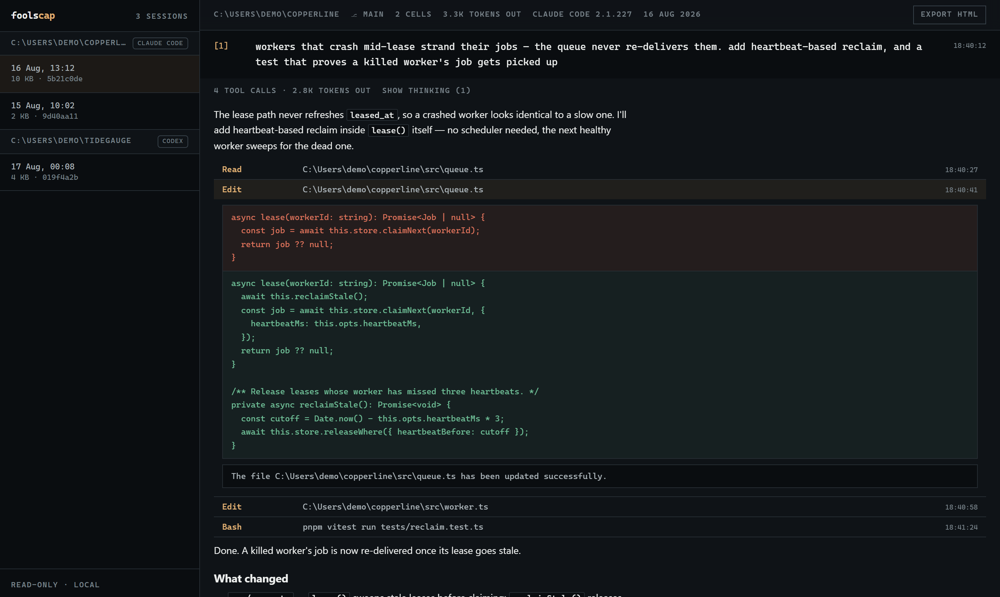

# foolscap

**The notebook for coding agents.** Your agent sessions, rendered as
documents — dense, replayable, shareable.




Jupyter didn't beat the REPL with a prettier terminal — it turned sessions
into **documents**. Agent sessions deserve the same. Every run becomes a
notebook you can read top-to-bottom, audit, and hand to someone else:
prompts as numbered cells; diffs, tool calls, thinking and costs as outputs
nested inside them.

> _foolscap: the paper ledgers were written on._

---

## Why

Terminals are superb for issuing precise commands and terrible for reading
what an agent *did*. The record of hours of agent work — every edit, every
command, every decision — disappears into scrollback, or into JSONL files
nobody opens. That record deserves to be a legible artifact:

- **Reviewable** — see every change an agent made, as diffs, in context
- **Recallable** — "what did we do in Tuesday's session?" has an answer
- **Shareable** — a session exports to one self-contained HTML file
- **Yours** — local-first; your sessions never leave your disk

## Supported harnesses

foolscap is **harness-agnostic by design**: every harness is one adapter
that maps its on-disk log format into a neutral session document. The
renderer, exporter and skill never know which tool wrote the session.

| Harness | Status | Reads from |
|---|---|---|
| Claude Code | ✅ | `~/.claude/projects/**/*.jsonl` |
| Codex CLI | ✅ | `~/.codex/sessions/**/rollout-*.jsonl` |
| DeepSeek Harness (dsh) | ✅ | `~/.dsh/…/session.jsonl[.zstd]` |
| **Any ACP agent**, via the fleet | ✅ | `~/.foolscap/acp/*.jsonl` (recorded by foolscap) |
| Gemini CLI | planned | — |
| opencode | planned | — |
| aider | planned | `.aider.chat.history.md` |

dsh sessions are zstd-compressed by default; foolscap decompresses them
with Node's built-in zstd (Node 22.15+ — plain `.jsonl` works on any
supported Node). `DSH_HOME` is honored, same as dsh itself.

Your harness missing? [Adding one is a single file](#add-a-harness).

## Quickstart

One command, no clone (Node 20+):

```sh
npx foolscap
```

It serves on **127.0.0.1 only** — your sessions are private data and never
leave your machine — and opens the viewer on your archive. **Zero
configuration**: if you've used Claude Code, Codex or DeepSeek Harness,
it's already there.
`foolscap --root <dir>` views a copied or curated archive; `--port` and
`--no-open` do what they say.

For development (Node 24+ and pnpm):

```sh
git clone https://github.com/N-45div/foolscap
cd foolscap
pnpm install
pnpm dev        # http://localhost:5173
```

## The fleet — many agents, one queue

Running five agents at once fails for one reason: every surface shows
you five terminals, so you poll all of them and the bookkeeping costs
more than the work. The fleet inverts it. foolscap is the [ACP](https://agentclientprotocol.com)
client for each agent — it sends the prompts, receives the stream,
answers permission requests — so it knows, exactly and live, which agent
is **blocked on you**, which one's **tests just went red**, which is
**done and waiting**, and which is fine and should be left alone. That's
shown as a queue, not a grid:

```
needs you   ⚠ auth-refactor     waiting for permission        12s
            ✗ payment-webhook   tests failing (2)             4m
review      ● docs-sweep        tests passed · edited 3 files  1m
working     ◌ queue-backoff     pnpm test                     —
```

- **`n`** jumps to whatever needs you next; **`a`** / **`d`** answer a
  permission request. Inbox zero, for agents.
- The tab title carries the count — `(2) foolscap — needs you` — so you
  can be in another window.
- Each agent opens as a document: the same renderer as the archive,
  because it is the same document. Every session is recorded, so it's
  in your archive the moment it ends, with the same outcome evidence.
- Works with any agent that speaks ACP over stdio: Claude Code, Codex,
  Gemini CLI, or a command you name.

Open **⚡ fleet** in the sidebar. Launching an agent runs code on your
machine, so the fleet API is loopback-only and refuses cross-origin
requests outright.

### `foolscap acp` — an agent over the network

ACP standardizes the client↔harness boundary, but every client today
spawns its agent as a local subprocess. `foolscap acp` serves any stdio
ACP agent over an authenticated WebSocket, so you can hand the endpoint
to a client anywhere — and the session is recorded here.

```sh
foolscap acp --agent claude --cwd ~/myproject
# → ws://127.0.0.1:4518/?token=<generated>
```

A token is required and generated per run (there is no open mode);
loopback is the default and `--expose` warns loudly. To launch a known
agent through a custom install or wrapper, set
`FOOLSCAP_ACP_CLAUDE="…"` (or `_CODEX`, `_GEMINI`) to the command.

## Features

- **Sessions as documents** — each prompt opens a numbered cell `[1]`,
  `[2]`, …; the agent's work nests inside it
- **The prompt shelf** — your prompt library, *derived*: every prompt
  you've ever sent, across harnesses, deduplicated with reuse counts.
  Filter, copy, star (stars live in `~/.foolscap`, never near session
  files), and jump back to the session where you used one
- **Search the whole archive** — every session, every harness, ranked by
  match count with a snippet; Enter to search, Esc to clear
- **Cell permalinks & keyboard nav** — `#cell-7` deep-links a cell, in
  the viewer and in exports; `j`/`k` walk the document notebook-style
- **Tool calls as ledger rows** — one line each, expandable to full
  inputs, results and errors
- **Subagent fan-outs as nested documents** — every `Agent` call opens
  into the transcript of the agent it launched, recursively, loaded on
  demand
- **Edits as diffs** — old/new rendered red/green
- **Markdown, rendered** — the agent's answers display as real documents
  (headings, tables, code fences), sanitized before display
- **Thinking, collapsed** — reasoning is there when you want it, out of
  the way when you don't
- **Provenance header** — cwd, branch, harness + version, cell count,
  token totals where the format records them; tabular numerals throughout
- **Read-only by construction** — foolscap never writes to session files

## Export

One button (or one command) renders a session to a **single self-contained
HTML file**: no JavaScript, no external requests, dark/light from the
reader's OS, expand/collapse via native `<details>`. Host it, mail it,
attach it to a PR.

> ⚠️ Exports include tool inputs and results **verbatim** — review for
> secrets (keys, env vars, tokens) before sharing.

## CLI

No build step — Node 24 runs the TypeScript directly:

```sh
node cli.ts list                           # recent sessions, every harness
node cli.ts list --source dsh              # claude | codex | dsh
node cli.ts prompts --filter migration     # the prompt shelf, in the terminal
node cli.ts prompts --starred              # your curated set
node cli.ts export latest -o session.html  # shareable document
node cli.ts path <id-prefix>                # locate a session's file
```

## Agent skill

`skills/foolscap/SKILL.md` teaches a Claude Code agent to operate the
archive itself — recall, summarize and export past sessions:

```sh
npx foolscap skill
```

(or from a clone: `cp -r skills/foolscap ~/.claude/skills/foolscap`)

Then ask your agent things like *"what did we change in yesterday's
session?"*. The skill is read-only by instruction and never shares an
export without your explicit say-so.

## Architecture

Three layers; the middle one is the point.

```
adapters                 the document            surfaces
src/sources/*.ts   →     SessionDoc        →     viewer · export · CLI · skill
(one per harness)        (neutral model)         (never know the harness)
```

An adapter implements one function:

```ts
parse(raw: string): SessionDoc
```

plus a discovery entry that says where its files live. Parsing is
deliberately tolerant — unknown entry types are skipped, malformed lines
are counted, and a session that half-parses renders half a notebook, never
a blank screen.

### Custom archive roots

`FOOLSCAP_ROOT` points the viewer at any directory — a copied archive from
another machine, a backup, a fixture set:

```sh
FOOLSCAP_ROOT=/path/to/archive pnpm dev
```

Two layouts are understood: per-source subdirectories (`<root>/claude/…`,
`<root>/codex/…`, `<root>/dsh/…`) or a bare Claude-style projects
directory. When `FOOLSCAP_ROOT` is set, **only** that root is scanned.

## Add a harness

The ideal first contribution. To support a new agent tool:

1. **`src/sources/yours.ts`** — implement `parse(raw): SessionDoc`.
   Map prompts to cells, tool invocations to `ToolInteraction`s (pair
   calls with results by id), reasoning to `thinking` parts. Be tolerant:
   never throw on a malformed line.
2. **Register it** in `src/sources/index.ts` (id + label + parser).
3. **Add discovery** in `server/core.mjs` — a `scanYours(root)` that
   finds the files and groups them into projects, plus a root in
   `resolveRoots()`. Prompt extraction for the shelf is a few lines in
   the same file.
4. Open a PR with a small **synthetic** fixture file (never real session
   data — transcripts contain private material).

If your agent writes a log, foolscap can be its notebook.

## Roadmap

- **v0.3 — the fleet** (shipping now): steer many agents from one
  queue; remote agents via `foolscap acp`; outcome evidence live.
- **v0.4 — The notebook earns its name.** Re-run a cell with an edited
  prompt (the shelf becomes a launcher), fork a session from any point,
  session diffing, fleets across machines.
- **Self-contained app.** Tauri wrapper (Rust core) — one small binary,
  no Node required.
- More harnesses: Gemini CLI, opencode, aider, and yours.

## Philosophy

Local-first, Obsidian-style: the archive is files on your disk, and
foolscap is a lens over them — never a database, never a cloud. Read-only
against session files, always. Sessions contain private material, so
nothing leaves your machine unless you explicitly export it, and exports
warn you to review before sharing.

## License

[MIT](LICENSE)
